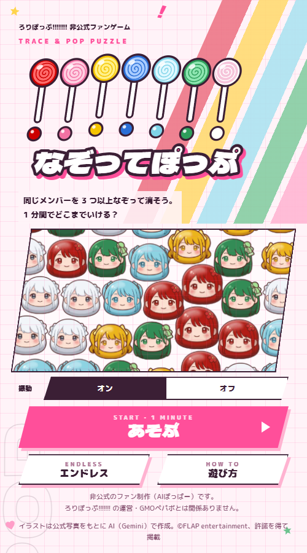
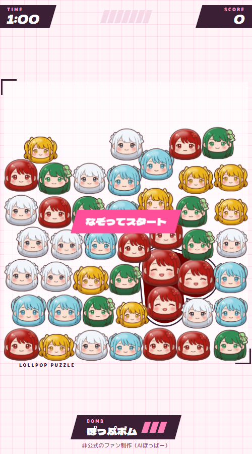
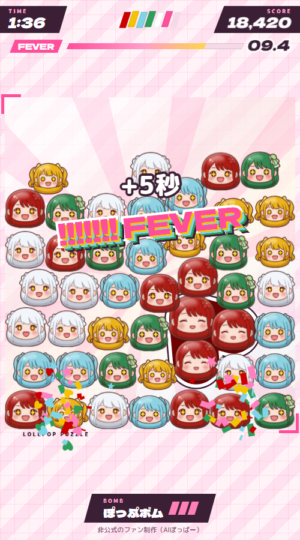
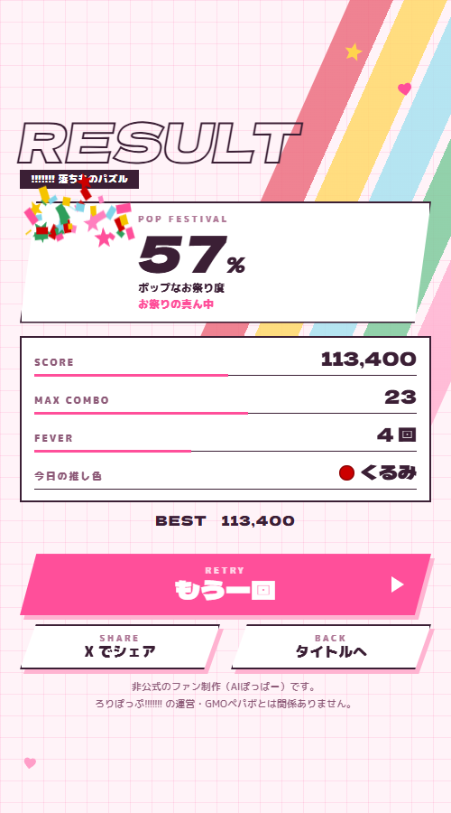

<!--
デプロイナウコンテスト応募用の作品説明（下書き）。
- 応募フォームの入力欄の分量が未確認なので、「短い版」と「詳しい版」の 2 つを用意した。欄に合わせて選ぶ
- 画像は docs/articles/images/ にある（本番を 500×900 で撮影したもの）
- 事実の出典：README.md、js/config.js（数値）、lollpop_docs の members/members.md（メンバー表記）
-->

# !!!!!!! なぞってぽっぷ — 作品説明

公開 URL：https://lollpop-puzzle.lolipop-now.app/

## 短い版（フォーム用・約 200 字）

アイドルグループ「ろりぽっぷ!!!!!!!」のファンとして作った、ツムツム風のなぞり消しパズル「!!!!!!! なぞってぽっぷ」です。メンバー 5 人の顔の駒を、同じメンバーどうし 3 個以上なぞってつなげて消します。消した数で「!」が溜まり、7 個そろうと「!!!!!!! フィーバー」。1 分間でどこまで盛り上げられるかを競い、結果は「ポップなお祭り度」で表示します。スマホのブラウザだけで、インストールなしで遊べます。非公式のファン制作です。

## 詳しい版

### 作りたかったもの

スマホで何度も遊んでしまう、ツムツムのような「なぞってつなげて消す」パズルを、自分が応援しているアイドルグループ「ろりぽっぷ!!!!!!!」で作りたいと思ったのが始まりです。

グループ名に付いている 7 個の「!」と、メンバー 5 人の担当カラー（赤・黄・水色・緑・白）は、そのままゲームの仕組みにできると考えました。駒の色はメンバーカラー、フィーバーの合図は「!!!!!!!」です。ライブの合間の待ち時間に 1 分で 1 回遊べて、結果をそのまま X でシェアできる、という手軽さを目指しました。

### 遊び方

- **なぞって消す**：同じ色の駒を 3 個以上なぞって、指を離すと消えます。続けて消すとコンボになり、得点が伸びます
- **スター飴**：7 個以上つなぐと「スター飴」が出ます。タップすると周りをまとめて消せます
- **!!!!!!! フィーバー**：8 個消すごとに「!」が 1 個溜まり、7 個そろうとフィーバー。12 秒間、周りも巻き込んで消え、得点は 3 倍、残り時間も 5 秒延びます
- **ぽっぷボム**：つなげる組が見つからないときは、盤面の下を吹き飛ばして混ぜ直せます（1 試合 3 回）
- **LAST SPURT**：残り 10 秒は「!」が溜まりやすくなります。時間切れの瞬間にフィーバー中なら、終わるまで「BONUS TIME」が続きます
- **2 つのモード**：1 分で競う通常モードと、消し続けるかぎり続くエンドレス（「のこり」が減り続け、消すと回復。0 でゲームオーバー）

初めて遊ぶ人には、最初の 1 回だけ遊び方のカードが出ます。

### こだわったところ

**メンバー 5 人の駒と表情**
駒はメンバー 5 人（やぎくるみ・夏川茉夢・まう・松川愛美・愛月まな）の顔を、ぷっくりした 3D 風のデフォルメにしました。通常・笑顔・はじけ顔・フィーバー顔の 4 つの表情があり、消えた瞬間ははじけ顔、フィーバー中は全員が星の目になります。駒は丸い飴として箱の中に積もり、転がったり、着地でつぶれたりします。

**結果は「ポップなお祭り度」**
スコアをそのまま出すのではなく、グループのコンセプトにちなんだ「ポップなお祭り度」（%）とランクで表示します。いちばん多く消したメンバーを「今日の推し色」として出し、そのメンバーが全身で喜ぶポーズを添えます。結果はボタン 1 つで X に投稿できます。

**スマホでの手触り**
効果音は音源ファイルを使わず、ブラウザの中で合成して鳴らしています。Android ではなぞるたびに軽く振動し、iPhone でもボタンを押したときに手応えが返るようにしました。操作は片手の親指だけで完結します。

### 使った技術と AI

- ビルドなしの静的サイト（素の JavaScript と Canvas）。ロリポップ！デプロイナウで公開しています
- 盤面は、丸い駒が積もって転がる簡単な物理シミュレーション。端末の性能によらず同じ動きになるように作りました
- 開発は Claude Code と一緒に進めました。メンバーの駒の絵は、公式写真を参考に Google の画像生成 AI（Gemini）で作画し、Claude Code から自動で生成・切り出しまで行いました（制作の詳細は技術記事にまとめています）

### 非公式のファン制作です

- 本作は「ろりぽっぷ!!!!!!!」のファンが個人で作った非公式のゲームです。ろりぽっぷ!!!!!!! の運営・GMOペパボとは関係ありません
- メンバーの駒の絵は、公式写真をもとに AI で作画したもので、運営の許諾を得て掲載しています
- メンバーカラー・曲名などの事実情報を除き、「ろりぽっぷ!!!!!!!」に関する権利はそれぞれの権利者に帰属します
- ソースコード：https://github.com/devhitoshi/lollpop_puzzle （コードは MIT ライセンス。メンバーの駒の絵は対象外）
