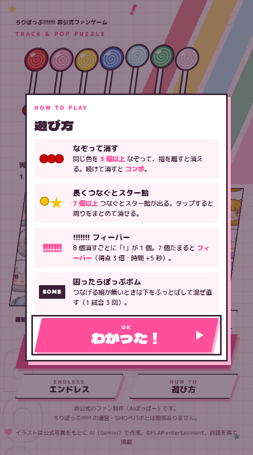
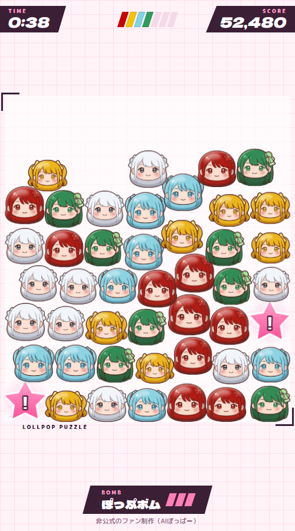
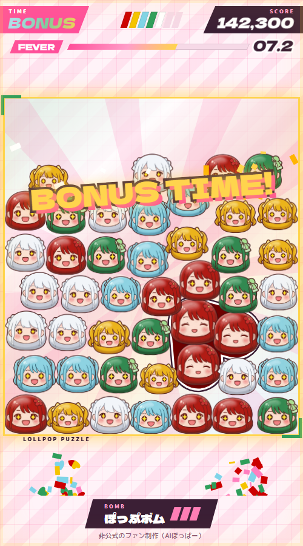
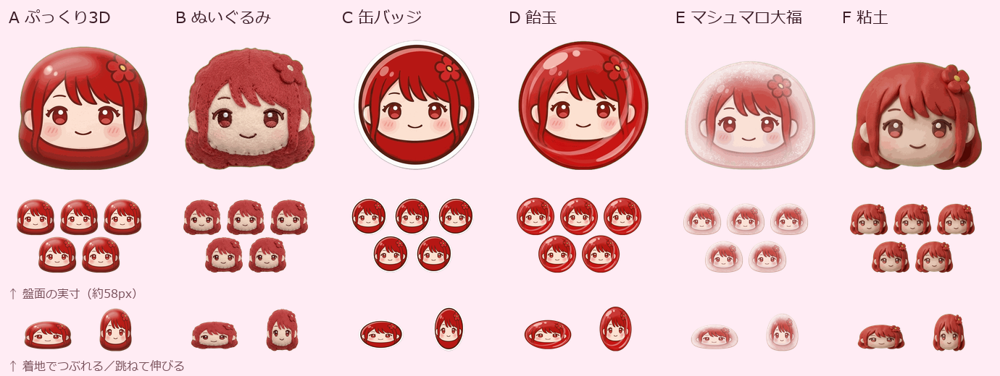

# 推しの顔をなぞって、!!!!!!! フィーバー。ろりぽっぷ!!!!!!!のブラウザゲーム「!!!!!!! なぞってぽっぷ」を作りました

<!-- note 用の原稿。画像は docs/articles/images/ のものを、各見出しの位置に貼る。末尾の「編集メモ」は投稿時に消す -->

アイドルグループ「ろりぽっぷ!!!!!!!」のメンバーの顔をなぞって消す、スマホのブラウザで遊べるパズルゲームを作りました。インストールは要りません。

**▶ 遊ぶ：https://lollpop-puzzle.lolipop-now.app/**

非公式のファン制作です。ろりぽっぷ!!!!!!! の運営・GMOペパボとは関係ありません。メンバーの絵は、公式写真をもとに AI（Gemini）で描いたもので、運営の許可をいただいて掲載しています。

## どんなゲーム？

盤面に積もったメンバー 5 人の顔の駒を、同じメンバーどうし 3 つ以上なぞってつなげ、指を離して消すパズルです。1 回は 1 分間。どこまで盛り上げられるかに挑戦します。

駒になっているのは、今のメンバー 5 人です。

- やぎくるみ（くるみん）：赤
- 夏川茉夢（おまゆ）：黄
- まう（まう～）：水色
- 松川愛美（あみてん）：緑
- 愛月まな（まなてぃー）：白

## なぜ作ったか

自分が応援している「ろりぽっぷ!!!!!!!」で、スマホでつい何度も遊んでしまう「なぞってつなげて消す」パズルを作りたいと思ったのが始まりです。

グループ名に付いている 7 個の「!」と、メンバー 5 人の担当カラーは、そのままゲームの仕組みにできると考えました。駒の色はメンバーカラー、フィーバーの合図は「!!!!!!!」です。

ライブの合間の待ち時間に 1 分で 1 回遊べて、結果をそのまま X でシェアできる。そんな手軽さを目指しました。

## 遊び方

1. タイトルで「あそぶ」（1 分）か「エンドレス」を選びます。
2. 同じメンバーの駒を 3 つ以上なぞって、指を離すと消えます。
3. 続けて消すと「コンボ」になり、得点が伸びます。
4. 8 個消すごとに「!」が 1 個たまり、7 個そろうと「!!!!!!! フィーバー」です。

操作は片手の親指だけで完結します。初めて遊ぶときは、最初の 1 回だけ遊び方のカードが出ます。最初の 1 回を消すまでは時間が減らないので、落ち着いて始められます。

### 長くつなぐと「スター飴」

7 個以上つなぐと、盤面にピンクの「スター飴」が出ます。タップすると、周りの駒をまとめて消せます。

長くつなぐほど得点も伸びるので、すぐ消すか、もう少しつなぐか、毎回ちょっと迷います。

### 困ったら「ぽっぷボム」

つなげる組が見つからないときは、画面下の「ぽっぷボム」を押します。盤面の下のほうを吹き飛ばして、駒を混ぜ直せます。1 試合で 3 回まで使えます。

## !!!!!!! フィーバー

「!」が 7 個そろうと、12 秒間の「!!!!!!! フィーバー」に入ります。

- なぞった駒の周りも巻き込んで消えます
- 得点は 3 倍です
- 残り時間が 5 秒延びます
- メンバー全員が星の目になります

グループ名の「!!!!!!!」がたまっていくのが、このゲームでいちばん見てほしいところです。

### ラストスパートとボーナスタイム

残り 10 秒になると「LAST SPURT」です。2 個消すごとに「!」が 1 個たまるので、最後にもう 1 回フィーバーを狙えます。

時間切れの瞬間にフィーバー中なら、そのフィーバーが終わるまで「BONUS TIME」が続きます。

## 結果は「ポップなお祭り度」

終わると、スコアをそのまま出すのではなく、「ポップなお祭り度」（%）とランクで結果を出します。ほかに、スコア、最大コンボ、フィーバーの回数が並びます。

いちばん多く消したメンバーが「今日の推し色」です。そのメンバーが全身で喜ぶポーズで出てきます。

結果は「X でシェア」のボタン 1 つで投稿できます。自己ベストは端末に保存されます。

## エンドレスモード

エンドレスモードには時間制限がありません。代わりに「のこり」が減り続け、駒を消すと戻ります。「のこり」が減る速さはだんだん上がっていき、0 になったらゲームオーバーです。結果には、続いた時間も出ます。

## こだわったところ

### 顔だけの、ぷっくりした駒

駒は、メンバー 5 人の顔をぷっくりした 3D 風にデフォルメしたものです。髪はメンバーカラーです。

最初は体のある絵でしたが、盤面で跳ねたときに可愛く見えなかったので、顔だけにしました。質感は、くるみんの絵で 6 つの案（ぷっくり 3D・ぬいぐるみ・缶バッジ・飴玉・マシュマロ大福・粘土）を描いて比べました。盤面の実際の大きさにしたとき、いちばん顔と色が読み取れたのが、ぷっくり 3D でした。

表情は 1 人 4 つあります。通常、笑顔、消えた瞬間のはじけ顔、フィーバー中の星の目です。結果画面の全身ポーズを合わせて、絵は全部で 25 枚です。

### 転がって、つぶれる

駒は、箱の中に積もった丸い飴のように動きます。消すと上の駒が転がり落ち、着地するときにぽよんとつぶれます。

### ロゴの「!」はメンバーカラー

タイトルのロゴの「!!!!!!!」は、ロリポップ（棒付きキャンディ）の形にしました。7 本の色は、卒業したメンバーも含めた 7 人のメンバーカラーです。

### スマホでの手触り

効果音は、音源ファイルを使わず、ブラウザの中で合成して鳴らしています。Android ではなぞるたびに軽く振動し、iPhone でもボタンを押したときに手応えが返るようにしました。振動はタイトル画面でオフにできます。

## ろりぽっぷ!!!!!!! が気になったら

ろりぽっぷ!!!!!!! は、東京を拠点に活動する 5 人組のアイドルグループです。2024 年 11 月にデビューしました。

- 曲を聴く：[最新 EP「全力疾走」](https://linkco.re/TMEz4nb9)
- 次のライブ：[公式のスケジュール（TimeTree）](https://timetreeapp.com/public_calendars/lollipop_1116)
- 公式 X：[@lollipop_1116](https://x.com/lollipop_1116)
- はじめての人向けのまとめ：[スターターパック（1）入門編](https://note.com/1116_fan/n/nd98992b3a1b8)

## 最後に

1 分で終わるので、ライブの開演待ちなど、ちょっとした時間にどうぞ。今日の推し色が誰になるか、ぜひ試してみてください。

**▶ 遊ぶ：https://lollpop-puzzle.lolipop-now.app/**

※ 非公式のファン制作です。ろりぽっぷ!!!!!!! の運営・GMOペパボとは関係ありません。メンバーの絵は、公式写真をもとに AI（Gemini）で作画し、許可をいただいて掲載しています（©FLAP entertainment）。楽曲の音源や歌詞は使っていません。

---

## 編集メモ（投稿時に削除）

- 画像はすべて `images/` にある。スマホ縦 500×900 でローカル（`?pos=`）を撮影
  - `title.png` `howto.png` `play.png` `fever.png` `styles.png` は既存のもの
  - `result.png` は 2026-09-29 に撮り直した。旧版は結果画面の表記が改名前の「落ちものパズル」で、推し色のポーズも写っていなかった（`?pos=result&seed=1`）。`contest_description.md` も同じ画像を参照している
  - `special.png`（`?pos=special&seed=1`）と `bonus.png`（`?pos=bonus&seed=1`）を足した
- 数値は `js/config.js` から（3 個・8 個で「!」1 個・7 個でフィーバー・12 秒・3 倍・+5 秒・スター飴 7 個・ボム 3 回・ラストスパート 10 秒で 2 個）
- 駒を顔だけにした理由（体があると跳ねたときに可愛くない）と 6 案の比較は `docs/handoff.md` の決定事項と `zenn_lollpop_puzzle.md` から
- ロゴの 7 色（卒業生を含む）は `docs/handoff.md` の 2026-09-29 夜の節から
- 手本にした定番ゲームの名前（ツムツム）は出していない。`contest_description.md` では出している。どちらに寄せるかはオーナー判断
- デプロイナウコンテストへの応募には触れていない。運営の承認後に書くなら、「最後に」の前に「GMOペパボ主催のデプロイナウコンテストに応募しています」の 1 文を足す
- BGM は未実装（合成のオリジナル曲に決定済み）。記事では効果音だけに触れた
- 結果のランク・お祭り度の段階名・満点ラインは仮の値なので、具体的な段階名とランクの境目は書いていない
- シェアのハッシュタグは `#ろりぽっぷパズル`（`CONFIG.share.hashtags`）。記事では触れていない
- `style_ai_poppar.md` の冒頭の注意書き（AI で分析して性格づけ）は、ほかのゲームの解説 note にそろえて入れていない
